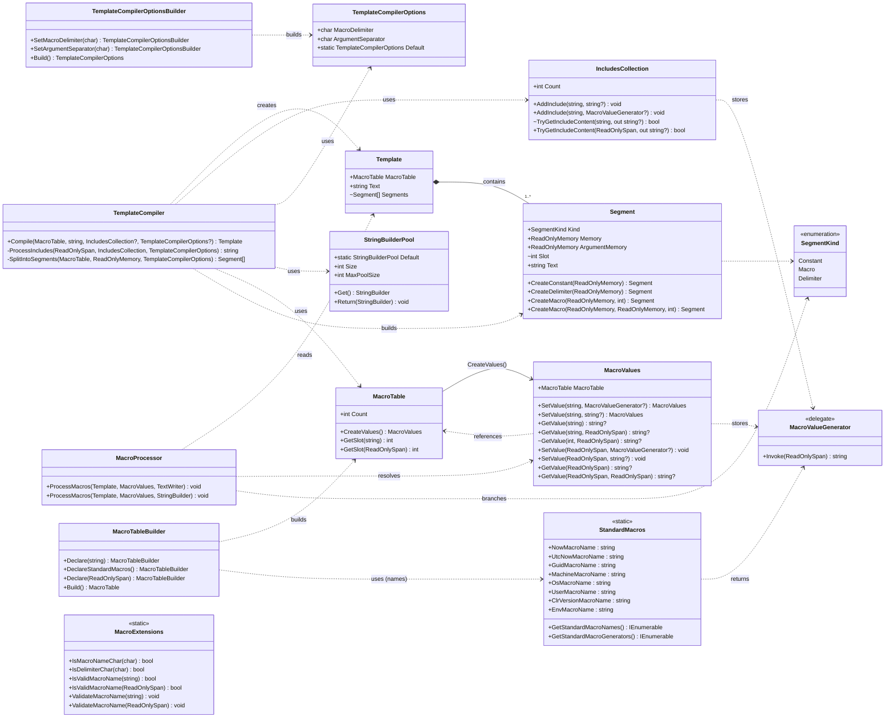
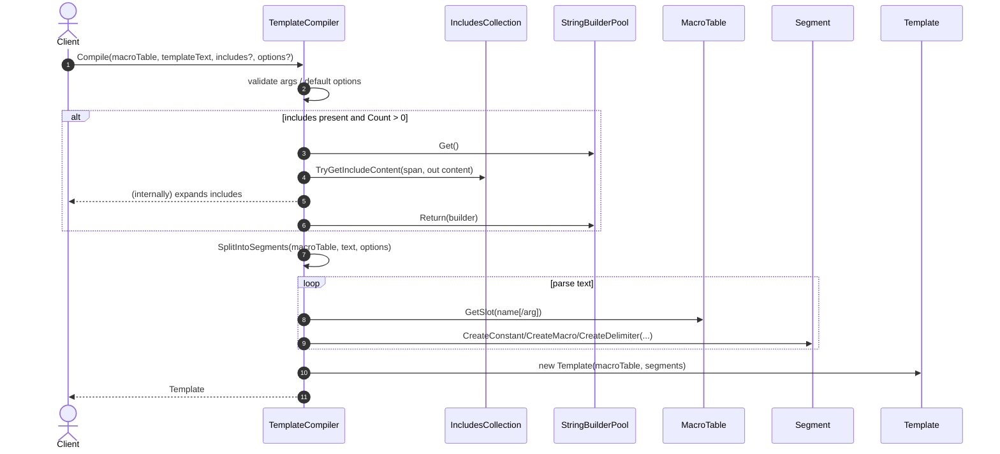
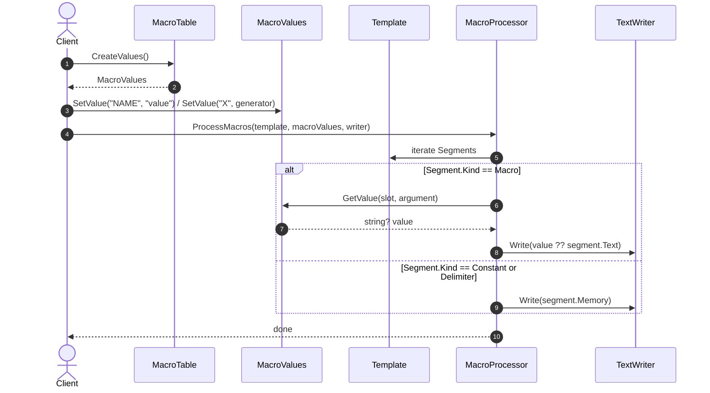
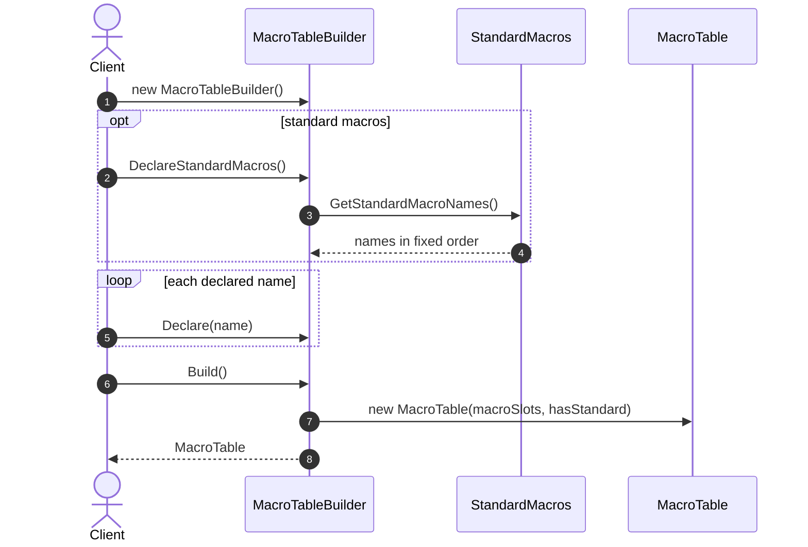

# Intercode.Toolbox.TemplateEngine

## Class Diagrams

```mermaid
classDiagram
  direction LR

  class Template {
    +MacroTable MacroTable
    +string Text
    ~Segment[] Segments
  }

  class Segment {
    +SegmentKind Kind
    +ReadOnlyMemory<char> Memory
    +ReadOnlyMemory<char> ArgumentMemory
    ~int Slot
    +string Text
    +CreateConstant(ReadOnlyMemory<char>) Segment
    +CreateDelimiter(ReadOnlyMemory<char>) Segment
    +CreateMacro(ReadOnlyMemory<char>, int) Segment
    +CreateMacro(ReadOnlyMemory<char>, ReadOnlyMemory<char>, int) Segment
  }

  class SegmentKind {
    <<enumeration>>
    Constant
    Macro
    Delimiter
  }

  class TemplateCompiler {
    +Compile(MacroTable, string, IncludesCollection?, TemplateCompilerOptions?) Template
    -ProcessIncludes(ReadOnlySpan<char>, IncludesCollection, TemplateCompilerOptions) string
    -SplitIntoSegments(MacroTable, ReadOnlyMemory<char>, TemplateCompilerOptions) Segment[]
  }

  class MacroTable {
    +int Count
    +CreateValues() MacroValues
    +GetSlot(string) int
    +GetSlot(ReadOnlySpan<char>) int
  }

  class MacroTableBuilder {
    +Declare(string) MacroTableBuilder
    +DeclareStandardMacros() MacroTableBuilder
    +Declare(ReadOnlySpan<char>) MacroTableBuilder
    +Build() MacroTable
  }

  class MacroValues {
    +MacroTable MacroTable
    +SetValue(string, MacroValueGenerator?) MacroValues
    +SetValue(string, string?) MacroValues
    +GetValue(string) string?
    +GetValue(string, ReadOnlySpan<char>) string?
    ~GetValue(int, ReadOnlySpan<char>) string?
    +SetValue(ReadOnlySpan<char>, MacroValueGenerator?) void
    +SetValue(ReadOnlySpan<char>, string?) void
    +GetValue(ReadOnlySpan<char>) string?
    +GetValue(ReadOnlySpan<char>, ReadOnlySpan<char>) string?
  }

  class MacroProcessor {
    +ProcessMacros(Template, MacroValues, TextWriter) void
    +ProcessMacros(Template, MacroValues, StringBuilder) void
  }

  class IncludesCollection {
    +int Count
    +AddInclude(string, string?) void
    +AddInclude(string, MacroValueGenerator?) void
    ~TryGetIncludeContent(string, out string?) bool
    +TryGetIncludeContent(ReadOnlySpan<char>, out string?) bool
  }

  class TemplateCompilerOptions {
    +char MacroDelimiter
    +char ArgumentSeparator
    +static TemplateCompilerOptions Default
  }

  class TemplateCompilerOptionsBuilder {
    +SetMacroDelimiter(char) TemplateCompilerOptionsBuilder
    +SetArgumentSeparator(char) TemplateCompilerOptionsBuilder
    +Build() TemplateCompilerOptions
  }

  class MacroExtensions {
    <<static>>
    +IsMacroNameChar(char) bool
    +IsDelimiterChar(char) bool
    +IsValidMacroName(string) bool
    +IsValidMacroName(ReadOnlySpan<char>) bool
    +ValidateMacroName(string) void
    +ValidateMacroName(ReadOnlySpan<char>) void
  }

  class StandardMacros {
    <<static>>
    +NowMacroName : string
    +UtcNowMacroName : string
    +GuidMacroName : string
    +MachineMacroName : string
    +OsMacroName : string
    +UserMacroName : string
    +ClrVersionMacroName : string
    +EnvMacroName : string
    +GetStandardMacroNames() IEnumerable<string>
    +GetStandardMacroGenerators() IEnumerable<MacroValueGenerator>
  }

  class StringBuilderPool {
    +static StringBuilderPool Default
    +int Size
    +int MaxPoolSize
    +Get() StringBuilder
    +Return(StringBuilder) void
  }

  class MacroValueGenerator {
    <<delegate>>
    +Invoke(ReadOnlySpan<char>) string
  }

  %% Relationships
  Template *-- "1..*" Segment : contains
  Segment ..> SegmentKind
  TemplateCompiler ..> Template : creates
  TemplateCompiler ..> IncludesCollection : uses
  TemplateCompiler ..> TemplateCompilerOptions : uses
  TemplateCompiler ..> StringBuilderPool : uses
  TemplateCompiler ..> MacroTable : uses
  TemplateCompiler ..> Segment : builds

  MacroTable --> MacroValues : CreateValues()
  MacroTableBuilder ..> MacroTable : builds
  MacroTableBuilder ..> StandardMacros : uses (names)

  MacroValues ..> MacroTable : references
  MacroValues ..> MacroValueGenerator : stores

  MacroProcessor ..> Template : reads
  MacroProcessor ..> MacroValues : resolves
  MacroProcessor ..> SegmentKind : branches

  IncludesCollection ..> MacroValueGenerator : stores

  TemplateCompilerOptionsBuilder ..> TemplateCompilerOptions : builds

  StandardMacros ..> MacroValueGenerator : returns
```

## Sequence Diagrams

### Template Compilation

```mermaid
sequenceDiagram
  autonumber
  actor Client
  participant TB as TemplateCompiler
  participant IT as IncludesCollection
  participant SBP as StringBuilderPool
  participant MT as MacroTable
  participant SEG as Segment
  participant T as Template

  Client->>TB: Compile(macroTable, templateText, includes?, options?)
  TB->>TB: validate args / default options
  alt includes present and Count > 0
    TB->>SBP: Get()
    TB->>IT: TryGetIncludeContent(span, out content)
    TB-->>Client: (internally) expands includes
    TB->>SBP: Return(builder)
  end
  TB->>TB: SplitIntoSegments(macroTable, text, options)
  loop parse text
    TB->>MT: GetSlot(name[/arg])
    TB->>SEG: CreateConstant/CreateMacro/CreateDelimiter(...)
  end
  TB->>T: new Template(macroTable, segments)
  TB-->>Client: Template
```

### Macro Processing

```mermaid
sequenceDiagram
  autonumber
  actor Client
  participant MT as MacroTable
  participant MV as MacroValues
  participant T as Template
  participant MP as MacroProcessor
  participant W as TextWriter

  Client->>MT: CreateValues()
  MT-->>Client: MacroValues
  Client->>MV: SetValue("NAME", "value") / SetValue("X", generator)
  Client->>MP: ProcessMacros(template, macroValues, writer)
  MP->>T: iterate Segments
  alt Segment.Kind == Macro
    MP->>MV: GetValue(slot, argument)
    MV-->>MP: string? value
    MP->>W: Write(value ?? segment.Text)
  else Segment.Kind == Constant or Delimiter
    MP->>W: Write(segment.Memory)
  end
  MP-->>Client: done
```

### Macro Table Building

```mermaid
sequenceDiagram
  autonumber
  actor Client
  participant MTB as MacroTableBuilder
  participant SM as StandardMacros
  participant MT as MacroTable

  Client->>MTB: new MacroTableBuilder()
  opt standard macros
    Client->>MTB: DeclareStandardMacros()
    MTB->>SM: GetStandardMacroNames()
    SM-->>MTB: names in fixed order
  end
  loop each declared name
    Client->>MTB: Declare(name)
  end
  Client->>MTB: Build()
  MTB->>MT: new MacroTable(macroSlots, hasStandard)
  MTB-->>Client: MacroTable
```
