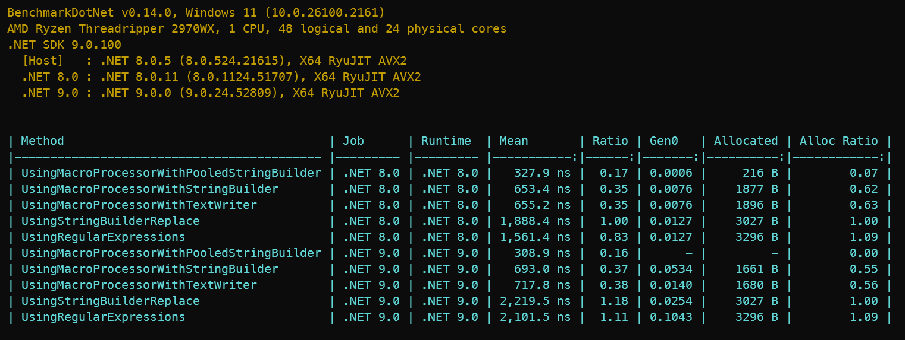

# Intercode.Toolbox.TemplateEngine

## Description

A fast and simple templatating engine used by the [Intercode.Toolbox.TypedPrimitives](https://www.nuget.org/packages/Intercode.Toolbox.TypedPrimitives/) package.

A template is a string that can contain one or macros that will be replaced by their corresponding values; a macro name is a string delimited, 
by default, by `$` characters. For example:

```
Hello, $Name$!
```

> **NOTE:** A delimiter can be any character, but it must be the same for the start and end of the macro name. The delimiter is
escaped by doubling it, so `$$` is a literal `$` character. To avoid escaping too many delimiters and simplify the 
templates, a character that is not commonly found in the template's text should be chosen.

The macro processor is case-insensitive, so `$Name$` and `$name$` are the refer to the same macro values.

## Usage

Lets see a short example of how to process macros:

```csharp
 TemplateCompiler compiler = new();
 Template template = compiler.Compile( "Hello, $Name$!" );

 MacroProcessorBuilder builder = new();
 builder.AddMacro( "Name", "John" );

 MacroProcessor processor = builder.Build();
 StringWriter writer = new();
 processor.ProcessMacros( template, writer );

 var result = writer.ToString();

 // Result should be "Hello, John!"
```
<br/>

**Step 1: Create a `TemplateCompiler` Instance**

First, create a `TemplateCompiler` instance to parse the template text and generate a `Template` instance. A `Template` comprises segments of the
template text, which can either be constant text or macros. You can cache and reuse `Template` instances to process various sets of macro values, 
preventing the need to compile the same template text multiple times. Passing a `TemplateEngineOptions` instance to the `TemplateCompiler` constructor
will allow overriding the default macro delimiter.

**Step 2: Build a `MacroProcessor`**

Next, instantiate a `MacroProcessorBuilder` to create a `MacroProcessor`. Use the builder to add the necessary macros, each defined as a pair of
strings—the macro name and its value. Once you've added all required macros, call the `Build` method to create the `MacroProcessor` instance. 
Given that creating a `MacroProcessor` is a relatively expensive operation, it's recommended to reuse it when processing multiple templates that
use the same macro **values**. If a customized `TemplateEngineOptions` instance was used in the previous step, the `MacroProcessorBuilder` should
also be instantiated with the same options.

**Step 3: Process Macros in the Template**

Finally, utilize the `ProcessMacros` method of the `MacroProcessor` to replace macros in the `Template` with their corresponding values. The processed template text will be written to the provided `StringWriter` instance, yielding the final output.


## Reference
---

### `TemplateEngineOptions` class

Represents the options for the claassses in the template engine.

#### Constructor

Creates a new instance of the `TemplateEngineOptions` class. The `macroDelimiter` parameter specifies the character used to delimit macro; if `null`,
the value in the `DefaultMacroDelimiter` constant is used.

```csharp
 TemplateEngineOptions( char? macroDelimiter = null )
```

#### Properties

- `MacroDelimiter` gets the character used to delimit macro names in the template text.

```csharp
char MacroDelimiter { get; }
```

### `TemplateCompiler` class

Compiles a template text into a `Template`

#### Constructor

Creates a new instance of the `TemplateCompiler` class. The `macroDelimiter` parameter specifies the character used to delimit macro
names in the template text. If `null`, the value in the `DefaultMacroDelimiter` constant is used.

```csharp
TemplateCompiler( char? macroDelimiter = null )
```

#### Methods

- `Compile` compiles the specified template text into a `Template` instance; an `ArgumentException` is thrown if the template text is `null` or empty.

```csharp
Template Compile( string text )
```

---

### `MacroProcessorBuilder` class

#### Constructor

Builds a `MacroProcessor` instance with the specified macros. The `macroDelimiter` parameter specifies the character used to delimit macro
names in the template text. If `null`, the value in the `DefaultMacroDelimiter` constant is used.

```csharp
MacroProcessorBuilder( char? macroDelimiter = null )
```

#### Methods

- `AddMacro` adds a macro to the builder. The `name` parameter is the macro name, and the `value` parameter is the macro value. 
An `ArgumentException` is thrown if the macro name is `null`, empty, all whitespaces, or contains any character that is not alphanumeric
or an underscore.

```csharp
MacroProcessorBuilder AddMacro( string name, string value )
```

- `Build` creates a `MacroProcessor` instance with the macros added to the builder. After it's built, the builder is automatically disposed
and cannot be reused.

```csharp
MacroProcessor Build()
```

### `MacroProcessor` class

Processes macros in a `Template` instance and writes the result to a `TextWriter`.

#### Methods

- `ProcessMacros` replaces macros in the specified `Template` instance with their corresponding values and writes the result to the provided `TextWriter`.

```csharp
void ProcessMacros( Template template, TextWriter writer )
 ```

 - `GetMacros` returns a read-only snapshot containing the macros added to the `MacroProcessor` instance.

 ```csharp
 IReadOnlyDictionary<string, string> GetMacros()
 ```

 - `GetMacroValue` returns the value of the specified macro name; the macro name shouldn't include the delimiters. If the macro name
 is not found, `null` is returned.
 
 ```csharp
 string? GetMacroValue( string macroName )
 ```

## Benchmarks
---

To benchmark the `TemplateEngine` we are going to parse the following template, taken from one of the standard templates
from the [Intercode.Toolbox.TypedPrimitives](https://www.nuget.org/packages/Intercode.Toolbox.TypedPrimitives/) package:
``` csharp
    // <auto-generated> This file has been auto generated by Intercode Toolbox Typed Primitives. </auto-generated>
    #nullable enable

    namespace $Namespace$;

    public partial class $TypeName$SystemTextJsonConverter: global::System.Text.Json.Serialization.JsonConverter<$TypeQualifiedName$>
    {
      public override bool CanConvert(
        global::System.Type typeToConvert )
      {
        return typeToConvert == typeof( $TypeQualifiedName$ );
      }

      public override $TypeQualifiedName$ Read(
        ref global::System.Text.Json.Utf8JsonReader reader,
        global::System.Type typeToConvert,
        global::System.Text.Json.JsonSerializerOptions options )
      {
        $TypeKeyword$? value = null;
        if( reader.TokenType != global::System.Text.Json.JsonTokenType.Null )
        {
          if( reader.TokenType == global::System.Text.Json.JsonTokenType.$JsonTokenType$ )
          {
            value = $JsonReader$;
          }
          else
          {
            bool converted = false;
            ConvertToPartial( ref reader, typeToConvert, options, ref value, ref converted );

            if ( !converted )
            {
              throw new global::System.Text.Json.JsonException( "Value must be a $JsonTokenType$" );
            }
          }
        }

        var result = $TypeQualifiedName$.Create( value );
        if( result.IsFailed )
        {
          throw new global::System.Text.Json.JsonException(
            global::System.Linq.Enumerable.First( result.Errors )
                  .Message
          );
        }

        return result.Value;
      }

      public override void Write(
        global::System.Text.Json.Utf8JsonWriter writer,
        $TypeQualifiedName$ value,
        global::System.Text.Json.JsonSerializerOptions options )
      {
        if ( value.IsDefault )
        {
          writer.WriteNullValue();
          return;
        }

        $JsonWriter$;
      }

      partial void ConvertToPartial(
        ref global::System.Text.Json.Utf8JsonReader reader,
        global::System.Type typeToConvert,
        global::System.Text.Json.JsonSerializerOptions options,
        ref $TypeKeyword$? value,
        ref bool converted );
    }
    
```

And we are going to use the following macro values:

| Macro Name | Value |
|------------|-------|
| `Namespace` | `Benchmark.Tests` |
| `TypeName` | `TestType` |
| `TypeQualifiedName` | `Benchmark.Tests.TestType` |
| `TypeKeyword` | `string` |
| `JsonTokenType` | `String` |
| `JsonReader` | `reader.GetString()` |
| `JsonWriter` | `writer.WriteStringValue( value.Value )` |

The benchmark [^1] code using [BenchmarkDotNet](https://benchmarkdotnet.org/):

[^1]: The code for the `TemplateEngineHelper` class just compiles the text into a `Template` and creates a `MacroProcessor` instance.
It is kept in a separate class because we only want to measure the actual macro processing time in this benchmark.

```csharp
[MemoryDiagnoser]
public partial class MacroProcessingTests
{
  private readonly Template _template;
  private readonly MacroProcessor _macroProcessor;
  private readonly IReadOnlyDictionary<string, string> _macros;

  public MacroProcessingTests()
  {
    var helper = new TemplateEngineHelper();
    _template = helper.Compile();
    _macroProcessor = helper.CreateMacroProcessor();
    _macros = _macroProcessor.GetMacros();
  }

  [Benchmark( OperationsPerInvoke = 3 )]
  public void UsingMacroProcessor()
  {
    var writer = new StringWriter();
    _macroProcessor.ProcessMacros( _template, writer );
  }

  [Benchmark( Baseline = true, OperationsPerInvoke = 3 )]
  public void UsingStringBuilderReplace()
  {
    var sb = new StringBuilder( _template.Text );
    foreach( var (macro, value) in _macros )
    {
      sb.Replace( macro, value );
    }

    var processed = sb.ToString();
  }

  [Benchmark( OperationsPerInvoke = 3 )]
  public void UsingRegularExpressions()
  {
    var result = CreateMacroNameRegex()
      .Replace(
        _template.Text,
        match =>
        {
          var key = match.Groups[1].Value;
          return _macros.TryGetValue( key, out var value ) ? value : match.Value;
        }
      );
  }

  [GeneratedRegex( @"\$([^$]+)\$" )]
  private static partial Regex CreateMacroNameRegex();
}

```

Only the macro replacement code within the template is being benchmarked. As the results indicate, the `MacroProcessor` demonstrates significantly 
faster performance and lower memory allocation compared to the `StringBuilder` and `Regex` implementations.



---

## License

This project is licensed under the [MIT License](LICENSE).
